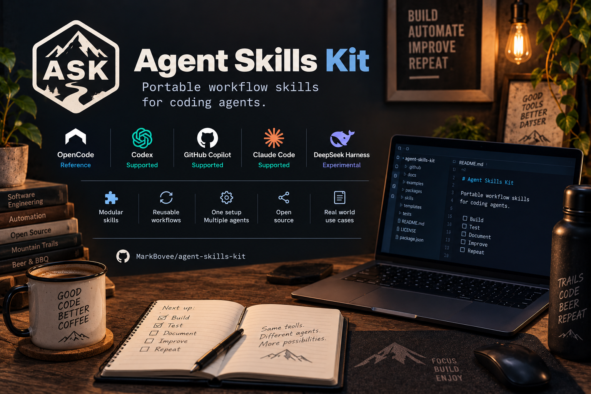
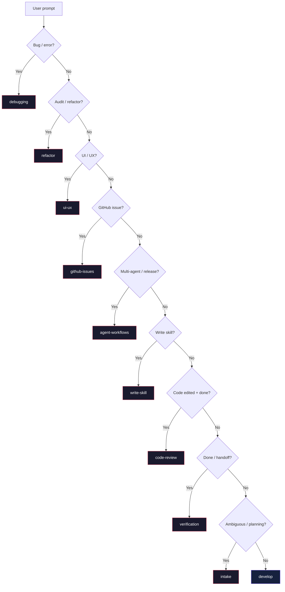

<p align="center">
  
</p>

<p align="center">
  <strong>Workflow skills and routing support for coding agents.</strong><br />
  A curated skill pack for OpenCode, GitHub Copilot, and Claude Code — purpose-built workflow guidance without the boilerplate.
</p>

<p align="center">
  
  
  
  
</p>

<p align="center">
  <code>10 skills</code>
  <code>1 router plugin</code>
  <code>3 platforms</code>
  <code>review + verification</code>
</p>

<p align="center">
  <a href="#install">Install</a> •
  <a href="#skills">Skills</a> •
  <a href="#workflow-model">Workflow</a> •
  <a href="#router">Router</a> •
  <a href="#maintenance">Maintenance</a> •
  <a href="#repo-map">Repo Map</a> •
  <a href="./CHANGELOG.md">Changelog</a>
</p>

---

## Overview

| Signal | What it means |
| --- | --- |
| One canonical source | Skills live once under `skills/` and export into native GitHub Copilot and Claude Code formats. |
| OpenCode is reference | Router behavior and plugin support are designed around OpenCode first. |
| Develop by default | Normal software work starts with steady iterative progress, not heavyweight process. |
| Hints only | Router suggests skills. It does not rewrite commands, auto-run tools, or hijack sessions. |

## Design Goals

- Sharpen workflow routing without building a monolithic prompt constitution.
- Treat implementation, debugging, review, verification, and wrap-up as explicit, intentional stages.
- Ship portable workflow guidance from a single repository to three agent platforms.
- Require proof that matches the claim — not ritual for its own sake.
- Stay compatible with existing tooling such as `nebu-ctx`.

Project changes are tracked in [CHANGELOG.md](./CHANGELOG.md).

Stable installs resolve the latest `vX.Y.Z` tag before copying managed assets. The bootstrap entrypoints are fetched from `main`, but the managed checkout prefers the newest stable tag and only falls back to the current checkout when no stable tag exists yet.

---

## Install

The bootstrap script is the recommended path. It clones if needed, moves the managed checkout to the latest stable tag, installs managed assets, and stays safe to rerun.

### Unified Installer

The managed installer now does one thing: install all shared skills into `~/.agents/skills`, install Copilot instructions, install the OpenCode router/plugin, and, when `~/.claude/` already exists, write Claude rules and link `~/.claude/skills` back to `~/.agents/skills`.

If you want non-default locations, set environment variables before running the installer:

- `AGENTS_DIR`
- `COPILOT_DIR`
- `OPENCODE_DIR`
- `CLAUDE_DIR`

### Bootstrap

**Linux / macOS — Bash:**
```bash
curl -fsSL https://raw.githubusercontent.com/MarkBovee/nebu-skills/main/scripts/bootstrap.sh | bash
```

**Windows — PowerShell:**
```powershell
irm https://raw.githubusercontent.com/MarkBovee/nebu-skills/main/scripts/bootstrap.ps1 | iex
```

<details>
<summary><strong>Detailed install paths and local-clone commands</strong></summary>

Local clone install:

**Linux / macOS — Bash:**
```bash
gh repo clone MarkBovee/nebu-skills
cd nebu-skills
bash ./scripts/install.sh
```

**Windows — PowerShell:**
```powershell
pwsh -NoLogo -NoProfile -File .\scripts\install.ps1
```

### OpenCode Details

Manual install copies:

- all folders under `~/.agents/skills/`
- `core/router-core.js`
- `plugins/nebu-skills-router.js`


Common OpenCode config locations:

| Platform | Path |
| --- | --- |
| macOS / Linux / WSL | `~/.config/opencode/` |
| Windows PowerShell | `$HOME\.config\opencode\` |

Custom roots use the unified installer via environment variables instead of platform-specific positional arguments.

### GitHub Copilot Details

Installed paths:

- `~/.agents/skills/`
- `~/.copilot/instructions/`

VS Code / Copilot now consumes the shared skill root from `~/.agents/skills/`. The Copilot-specific part that remains native is `~/.copilot/instructions/`.

The repository also ships a VS Code Agent Plugin under `.claude-plugin/`, with native skills under `skills/` and lifecycle hooks under `hooks/`. Install it from the GitHub repository through `Chat: Install Plugin From Source`, or register a local checkout with `chat.pluginLocations`:

```json
{
  "chat.pluginLocations": {
    "/path/to/nebu-skills": true
  }
}
```

Native Agent Skills perform the automatic relevance-based loading. The plugin manifest and hooks are maintained source assets; `scripts/validate-plugin.js` checks their contract and version alignment. The plugin hooks only add compact session guidance and non-blocking prompt hints; they do not execute skills, rewrite commands, or approve tools. The `SessionStart` hook also surfaces the same cost-aware execution-profile hint described under [Router](#router), and the `UserPromptSubmit` hook recomputes it per prompt (it does not yet track code-edit state across calls the way the OpenCode plugin does, since no post-tool-execution hook event is wired here). Hooks are preview functionality in VS Code. Inspect loaded skills in Agent Customizations and hook activity in Agent Debug Logs.

### Claude Code Details

Installed paths:

- `~/.agents/skills/`
- `~/.claude/rules/`

If `~/.claude/` exists, the installer writes Claude rules under `~/.claude/rules/` and links `~/.claude/skills` back to `~/.agents/skills`.

If `~/.claude/` does not exist, Claude-specific setup is skipped on purpose. Create the directory first if you want the installer to wire Claude into the shared `~/.agents/skills` root.

### Shared Root Policy

Skills are now centralized in `~/.agents/skills/`. The remaining editor-specific surfaces are:

- VS Code / Copilot still uses `~/.copilot/instructions/` for user instructions
- Claude Code still uses `~/.claude/CLAUDE.md` and `~/.claude/rules/` for instructions and rules
- OpenCode still uses its own config/plugin surfaces under `~/.config/opencode/`

The unified installer removes old managed skill copies from editor-specific skill directories so `~/.agents/skills/` becomes the single managed source of truth.

</details>

---

## Skills

Skills use short display names (e.g. `debugging`, `develop`) for easy reference. The `nebu-` prefix remains in directory names for namespace isolation.

### By Stage

| Stage | Skills | Purpose |
| --- | --- | --- |
| Start | `intake` | clarify fuzzy work before it gets expensive (brainstorming + scoping + planning) |
| Execute | `develop`, `debugging` | move code forward with small coherent loops |
| Validate | `code-review`, `verification` | review the diff and prove the claim (includes workspace wrap-up) |
| Improve | `refactor`, `github-issues` | audit, refactor, track issues |
| Coordinate | `agent-workflows`, `write-skill` | route work, finish cleanly, keep the skill system healthy |
| Product | `ui-ux` | push interface work beyond bland default SaaS output |

### Full Roster

| Skill | Tier | Purpose |
| --- | --- | --- |
| `develop` | standard | Default baseline: small, safe iterative software work (includes implementation mode selection) |
| `intake` | standard | Pre-execution: design exploration, scope clarification, and multi-phase planning |
| `debugging` | standard | Root-cause investigation |
| `code-review` | standard | Engineering review passes |
| `verification` | standard | Validation + workspace wrap-up before claiming completion |
| `refactor` | heavy | Audit-driven improvement + focused refactoring |
| `github-issues` | light | Structured issue management |
| `ui-ux` | heavy | UI and UX implementation support |
| `agent-workflows` | light | Multi-agent coordination + release chores |
| `write-skill` | standard | Skill authoring + workflow improvement tracking |

---

## Workflow Model

Default rhythm across the pack:

1. Inspect the next boundary that matters.
2. Create the smallest coherent change.
3. Prove the touched surface with the fastest trustworthy check.
4. Review the diff before claiming victory.
5. Continue until done or blocked for real.

That is why `develop` carries `default: true` in frontmatter. The router uses it as a baseline nudge without overriding a clearly stronger match.

The pack favors fast trustworthy checks, then proportional review and verification before completion claims.

---

## Router

`plugins/nebu-skills-router.js` uses a deterministic cascade: signal phrases are checked in priority order and the first match wins. No scoring, no ambiguity.

Cascade order:

1. Bug/error → `debugging`
2. Audit/refactor → `refactor`
3. UI/UX → `ui-ux`
4. GitHub issue → `github-issues`
5. Multi-agent/release chores → `agent-workflows`
6. Skill writing → `write-skill`
7. Code edited + done/ready → `code-review`
8. Done/ready/handoff → `verification`
9. Ambiguous/planning → `intake`
10. Default → `develop`



Session state tracks code edits so code-review activates when completion signals follow code changes.

### Cost-aware execution profile

Two optional frontmatter fields let a skill declare how expensive its default flow is, so hosts that support cheaper subagents or models can route mechanical work to them instead of the primary agent:

| `execution_tier` | Suggested `agentTier` | When to use | Example |
| --- | --- | --- | --- |
| `light` | `mini` | bounded, mechanical, single-pass work | `github-issues` |
| `standard` (default) | `default` | normal judgment-heavy work | `develop`, `intake`, `code-review`, `debugging`, `verification`, `write-skill` |
| `heavy` | `high` | broad or multi-part work, e.g. a full codebase audit or complex UI design | `refactor`, `ui-ux` |
| `deep` | `xhigh` | analysis-heavy or architectural work | — |

`delegation_default` (`auto` / `prefer-subagent` / `owner-only`) hints whether the work should default to a subagent when the host supports one. Both fields are read by `buildExecutionProfile` in `core/router-core.js`, which also upgrades the tier when the prompt itself signals light or heavy/deep work (e.g. "version bump" vs. "cross-repo migration"), regardless of which skill matched.

The result is injected as a single line, e.g. `Suggested execution profile: task=light, agent=mini, delegation=prefer-subagent, anchor=github-issues.` Treat it as a hint: pick the smallest/cheapest model or subagent class the host offers for `mini`, and escalate to `default`/`high`/`xhigh` only when scope grows or a cheap-first attempt fails. This only nudges routing — it never blocks a tool or forces delegation.

Hard boundaries:

- no command rewriting
- no automatic tool execution
- no session takeover
- no hidden automation
- clean coexistence with other plugins, including `nebu-ctx`

---

## Platform Matrix

| Platform | Ships | Generated assets or install target |
| --- | --- | --- |
| OpenCode | router plugin, routing support, bootstrap/install/update tooling | installs managed skills plus `core/router-core.js` and `plugins/nebu-skills-router.js` |
| GitHub Copilot | VS Code Agent Plugin, native skills, lifecycle hooks, generated skills, reusable instructions | `.claude-plugin/plugin.json`, `skills/`, `hooks/hooks.json`, `.github/skills/`, `.github/copilot-instructions.md`, `~/.agents/skills/`, `~/.copilot/instructions/` |
| Claude Code | generated skills, reusable rules, bootstrap/install/update tooling | `.claude/skills/`, `CLAUDE.md`, `~/.claude/skills/`, `~/.claude/rules/` |

OpenCode remains the reference implementation for routing behavior. GitHub Copilot and Claude Code exports are generated from the same canonical workflow source.

---

## Maintenance

Regenerate exported platform assets:

```bash
node ./scripts/export-platform-skills.js
```

Check trigger ownership and routing hygiene:

```bash
node ./scripts/check-trigger-overlap.js
```

Validate the VS Code plugin contract:

```bash
node ./scripts/validate-plugin.js
```

Load the router plugin directly:

```bash
node -e "require('./plugins/nebu-skills-router.js')"
```

Check release metadata before tagging:

```bash
node ./scripts/check-release-readiness.js
node ./scripts/check-release-readiness.js --require-version-entry
bash ./scripts/tag-release.sh --dry-run
```

**Windows — PowerShell:**
```powershell
pwsh -NoLogo -NoProfile -File .\scripts\tag-release.ps1 -DryRun
```

The release-readiness check also fails when shipped install surfaces changed since the latest stable tag but `VERSION` was not bumped above that tag yet.

Issue helper for duplicate checks before filing follow-up work:

```bash
skills/nebu-github-issues/check-existing-issue.sh "<query>" [owner/repo]
```

<details>
<summary><strong>Update commands</strong></summary>

Bootstrap-managed installs update when you rerun `bootstrap.sh` or `bootstrap.ps1` unless `SKIP_PULL=1` or `-SkipPull` is used.

`SKIP_PULL=1` and `-SkipPull` now skip the remote tag refresh step and reuse the current local checkout state.

Local clone install or update:

**Linux / macOS — Bash:**
```bash
bash ./scripts/install.sh

bash ./scripts/update.sh
bash ./scripts/update.sh --skip-pull
```

**Windows — PowerShell:**
```powershell
pwsh -NoLogo -NoProfile -File .\scripts\install.ps1

pwsh -NoLogo -NoProfile -File .\scripts\update.ps1
pwsh -NoLogo -NoProfile -File .\scripts\update.ps1 -SkipPull
```

The unified installer writes one local metadata file after each run:

- Shared managed root: `~/.agents/.nebu-skills-install.txt`

</details>

---

## Releases

- `VERSION` is the canonical repo version.
- `CHANGELOG.md` keeps `Unreleased` plus released version entries.
- Stable bootstrap and update scripts resolve the latest `vX.Y.Z` tag before install.
- Until the first stable tag exists, bootstrap and update scripts fall back to the current checkout and print that fallback.
- User-visible fixes to shipped assets should bump at least the patch version before handoff; bootstrap and update users do not receive the fix until the matching `vX.Y.Z` tag exists.

Suggested release flow:

1. Update `VERSION` with at least a patch bump for any shipped fix.
2. Move finished items from `Unreleased` into `## [x.y.z] - YYYY-MM-DD` in `CHANGELOG.md`.
3. Run `node ./scripts/check-release-readiness.js --require-version-entry`.
4. Run `node ./scripts/export-platform-skills.js` and relevant validation commands.
5. Create the release tag from `VERSION` with `bash ./scripts/tag-release.sh` or `pwsh -NoLogo -NoProfile -File .\scripts\tag-release.ps1`.
6. Add `--push` or `-Push` when you want the current branch and tag pushed to `origin` in one step.

The tag helpers refuse dirty worktrees, require a matching changelog entry, and create an annotated `vX.Y.Z` tag directly from `VERSION`.

---

## Repo Map

```text
skills/                     Canonical workflow skills
.github/skills/             Generated GitHub Copilot export
.claude/skills/             Generated Claude Code export

core/router-core.js         Shared scoring, frontmatter, and session helpers
plugins/nebu-skills-router.js

scripts/bootstrap-opencode.*
scripts/bootstrap.*
scripts/install.*
scripts/update.*
scripts/tag-release.*

VERSION                      Canonical release version
CHANGELOG.md                 Human-readable release history
scripts/check-release-readiness.js
```

---

## Notes

- OpenCode is the routing reference implementation.
- Visual assets live in `assets/social-preview.png`.
- For GitHub repo cards, use `assets/social-preview.png` as the social preview image.
- Restart OpenCode after install or update.
- Bootstrap scripts store a managed checkout in `REPO_DIR` when set. Default path is `XDG_DATA_HOME/nebu-skills` when available, otherwise `LOCALAPPDATA\nebu-skills` on PowerShell, then `~/.local/share/nebu-skills`.
- Stable updates use the newest SemVer tag available in the managed checkout.
- `ui-ux` includes Python scripts and CSV data for design guidance and requires Python `3.8+`.
- Installers overwrite only `nebu-skills` managed assets and preserve unrelated user customizations.
- Installers also remove stale managed skills during reinstall or update, including skills retired from the pack.
- The unified installer writes `.nebu-skills-install.txt` metadata in the shared `~/.agents/` root.
- Generated platform artifacts are derived output. Edit `skills/*/SKILL.md`, then re-export.

---

## Changelog

For project history, removals, and workflow shifts, see [CHANGELOG.md](./CHANGELOG.md).
