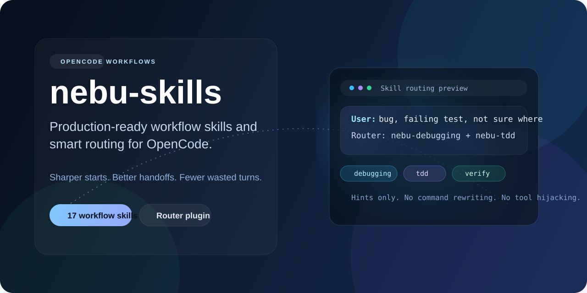

<p align="center">
  
</p>

<p align="center">
  Workflow skills and routing support for OpenCode, GitHub Copilot, and Claude Code.<br />
  OpenCode-first, with native support for all three platforms.
</p>

<p align="center">
  <a href="#install">Install</a> •
  <a href="#platform-support">Platforms</a> •
  <a href="#skills">Skills</a> •
  <a href="#how-it-works">How It Works</a> •
  <a href="#repo-structure">Repo Structure</a>
</p>

---

## Overview

`nebu-skills` is a workflow-oriented skill pack for coding agents.

It provides:

- structured workflow skills
- lightweight routing support
- reusable engineering patterns
- generated multi-platform exports
- install and update tooling

Supported platforms:

- OpenCode
- GitHub Copilot
- Claude Code

The canonical skill source lives in a single repository and is exported into native platform-specific formats.

---

## Design Goals

`nebu-skills` focuses on workflow structure instead of large prompt layers.

Core goals:

- improve task routing
- keep workflow stages explicit
- encourage consistent review and verification
- support reusable engineering patterns
- stay compatible with existing tooling

Router scope is intentionally narrow:

- no command rewriting
- no automatic tool execution
- no session hijacking
- no hidden automation

The goal is to make agent sessions more predictable, maintainable, and reusable across longer engineering workflows.

---

## What You Get

| Component | Included |
| --- | --- |
| Workflow skills | 17 |
| Router plugins | 1 |
| Supported platforms | 3 |
| Generated exports | GitHub Copilot + Claude Code |
| Install/update tooling | macOS, Linux, WSL, Windows PowerShell |

Main assets:

- `skills/`
- `plugins/nebu-skills-router.js`
- `core/router-core.js`
- `.github/skills/`
- `.claude/skills/`

---

## Platform Support

| Platform | Support |
| --- | --- |
| OpenCode | Router plugin, routing support, bootstrap/install/update tooling |
| GitHub Copilot | Generated skills + reusable instructions |
| Claude Code | Generated skills + reusable rules |

OpenCode remains the reference implementation for routing behavior and plugin support.

GitHub Copilot and Claude Code exports are generated from the same canonical workflow source.

---

## Generated Platform Assets

The canonical workflow skills live under `skills/`.

Platform-specific exports are generated from that source:

```bash
node ./scripts/export-platform-skills.js
```

Generated outputs:

- `.github/copilot-instructions.md`
- `.github/skills/`
- `CLAUDE.md`
- `.claude/skills/`

Default guidance also prefers concise intent comments during edits unless the repository already follows a different style.

---

# Install

## OpenCode

OpenCode is the primary platform and reference implementation.

### Bootstrap Install

Recommended install path.

The bootstrap script:

- clones the repository if needed
- updates existing installs
- installs required components
- is safe to rerun

### macOS / Linux

```bash
curl -fsSL https://raw.githubusercontent.com/MarkBovee/nebu-skills/main/scripts/bootstrap-opencode.sh | bash
```

### Windows PowerShell

```powershell
irm https://raw.githubusercontent.com/MarkBovee/nebu-skills/main/scripts/bootstrap-opencode.ps1 | iex
```

---

### Local Clone Install

```bash
gh repo clone MarkBovee/nebu-skills
cd nebu-skills
bash ./scripts/install-opencode.sh
```

```powershell
pwsh -NoLogo -NoProfile -File .\scripts\install-opencode.ps1
```

---

### Custom OpenCode Directory

```bash
bash ./scripts/install-opencode.sh /path/to/opencode
```

```powershell
pwsh -NoLogo -NoProfile -File .\scripts\install-opencode.ps1 -OpencodeDir "C:\path\to\opencode"
```

---

### Manual Install

Copy:

- all folders under `skills/`
- `core/router-core.js`
- `plugins/nebu-skills-router.js`

into the matching OpenCode config directories.

Common locations:

| Platform | Path |
| --- | --- |
| macOS / Linux / WSL | `~/.config/opencode/` |
| Windows PowerShell | `$HOME\.config\opencode\` |

---

## GitHub Copilot

Installs generated skills into:

- `~/.copilot/skills/`
- `~/.copilot/instructions/`

### macOS / Linux

```bash
bash ./scripts/install-copilot.sh
```

### Windows PowerShell

```powershell
pwsh -NoLogo -NoProfile -File .\scripts\install-copilot.ps1
```

---

## Claude Code

Installs generated skills into:

- `~/.claude/skills/`
- `~/.claude/rules/`

### macOS / Linux

```bash
bash ./scripts/install-claude-code.sh
```

### Windows PowerShell

```powershell
pwsh -NoLogo -NoProfile -File .\scripts\install-claude-code.ps1
```

---

# Update

Use the updater matching the installed platform.

```bash
bash ./scripts/update-opencode.sh
bash ./scripts/update-opencode.sh --skip-pull

bash ./scripts/update-copilot.sh
bash ./scripts/update-copilot.sh --skip-pull

bash ./scripts/update-claude-code.sh
bash ./scripts/update-claude-code.sh --skip-pull
```

---

# Skills

All managed workflow skills use the `nebu-` prefix for predictable routing and easier debugging.

| Skill | Purpose |
| --- | --- |
| `nebu-kaizen` | Small, safe iterative software work |
| `nebu-brainstorming` | Early-stage idea shaping |
| `nebu-kickoff` | Clarifying ambiguous work |
| `nebu-planning` | Multi-phase execution planning |
| `nebu-implementation` | Structured implementation flow |
| `nebu-debugging` | Root-cause investigation |
| `nebu-test-driven-development` | Behavior-first development |
| `nebu-code-review` | Engineering review passes |
| `nebu-github-issues` | Structured issue management |
| `nebu-verification` | Validation before claiming completion |
| `nebu-refactoring` | Cleanup and simplification |
| `nebu-ui-ux` | UI and UX implementation support |
| `nebu-agent-workflows` | Multi-agent coordination |
| `nebu-skill-improvement` | Workflow improvement tracking |
| `nebu-workspace-wrapup` | Workspace cleanup and handoff |
| `nebu-using-nebu-skills` | Skill discovery guidance |
| `nebu-writing-nebu-skills` | Skill authoring support |

---

# Workflow Coverage

| Stage | Skills |
| --- | --- |
| Start work | `nebu-kickoff`, `nebu-brainstorming`, `nebu-planning` |
| Execute work | `nebu-kaizen`, `nebu-implementation`, `nebu-debugging`, `nebu-refactoring` |
| Validate work | `nebu-test-driven-development`, `nebu-code-review`, `nebu-verification` |
| Improve workflows | `nebu-skill-improvement`, `nebu-github-issues` |
| Finish sessions | `nebu-workspace-wrapup` |

---

# Auto-Improvement Flow

`nebu-skills` treats reusable workflow friction as trackable engineering work.

Typical flow:

1. Agent executes the normal task workflow
2. Review or verification detects reusable friction
3. Work routes into `nebu-skill-improvement`
4. Small fixes can be applied directly
5. Improvements are tracked upstream through GitHub issues
6. Larger follow-ups become reusable workflow tasks instead of remaining isolated to a single session

Helper script:

```bash
skills/nebu-github-issues/check-existing-issue.sh "<query>" [owner/repo]
```

This performs a default duplicate search before creating a new issue.

---

# How It Works

## Skills

Each workflow skill is a self-contained `SKILL.md` file with YAML frontmatter:

- `name`
- `description`
- `triggers`

This structure powers:

- routing
- discovery
- scoring
- testing

---

## Router Plugin

`plugins/nebu-skills-router.js`:

- scans installed skills
- scores relevance against user intent
- injects lightweight routing hints into the system prompt

Important constraints:

- adds hints only
- does not auto-run tools
- does not rewrite commands
- does not take over sessions
- remains compatible with other OpenCode plugins

Additional behavior:

- tracks edit timing
- nudges review flow when appropriate
- tracks wrap-up timing
- encourages reusable workflow improvements before session end

---

## Install Scripts

Installers:

- copy managed skills
- install the shared router core
- install the router plugin
- remove legacy `lean-*` and `*leanctx*` installs
- clean up renamed legacy skills
- preserve unrelated plugins and user customizations
- remain safe to rerun

---

# nebu-ctx Compatibility

`nebu-skills` is intentionally compatible with `nebu-ctx`.

Router scope remains limited to workflow routing only.

It does not interfere with:

- shell rewriting
- tool output shaping
- external plugin responsibilities

---

# Repo Structure

```text
skills/                     Workflow skills
.github/skills/             Generated GitHub Copilot export
.claude/skills/             Generated Claude Code export

core/router-core.js
plugins/nebu-skills-router.js

scripts/install-copilot.*
scripts/update-copilot.*

scripts/install-claude-code.*
scripts/update-claude-code.*

scripts/bootstrap-opencode.*
scripts/install-opencode.*
scripts/update-opencode.*
```

---

# Notes

- OpenCode remains the reference implementation for routing behavior.
- GitHub Copilot installs into `~/.copilot/skills/` and `~/.copilot/instructions/`.
- Claude Code installs into `~/.claude/skills/` and `~/.claude/rules/`.
- Restart OpenCode after install or update.
- `bootstrap-opencode.ps1` stores repo cache in `XDG_DATA_HOME` when set, otherwise `LOCALAPPDATA`, then falls back to `$HOME\.local\share\nebu-skills`.
- `nebu-ui-ux` includes Python scripts and CSV data for design guidance and requires Python `3.8+`.
- Installers overwrite only `nebu-skills` managed assets.

---

# Status

`nebu-skills` is under active development and continues to evolve around real engineering workflow usage.

The current focus areas are:

- workflow consistency
- routing quality
- multi-platform support
- safer automation boundaries
- reusable engineering patterns
