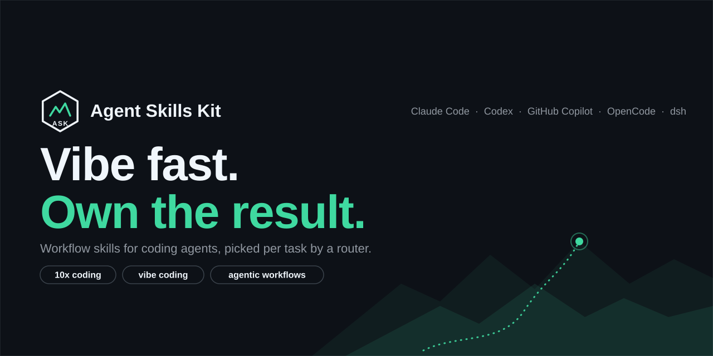
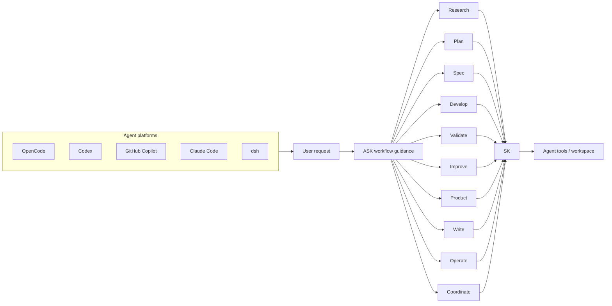

<p align="center">
  
</p>

<p align="center">
  <strong>ASK — Agent Skills Kit.</strong><br />
  Workflow skills and routing support for coding agents, built Claude Code first. One canonical skill system that also runs on OpenCode, Codex, GitHub Copilot, and DeepSeek Harness (dsh).
</p>

<p align="center">
  
  
  
  
  
</p>

<p align="center">
  
  
  
</p>

<p align="center">
  <code>ASK</code>
  <code>17 skills</code>
  <code>1 router</code>
  <code>5 agent hosts</code>
  <code>review + verification</code>
</p>

<p align="center">
  <a href="#install">Install</a> •
  <a href="#architecture">Architecture</a> •
  <a href="#skills">Skills</a> •
  <a href="#workflow-model">Workflow</a> •
  <a href="#router">Router</a> •
  <a href="#maintenance">Maintenance</a> •
  <a href="#repo-map">Repo Map</a> •
  <a href="./CHANGELOG.md">Changelog</a>
</p>

---

## Overview

**ASK** (Agent Skills Kit) keeps workflow skills and routing support in one canonical, platform-portable repository.

| Signal               | What it means                                                                                         |
| -------------------- | ----------------------------------------------------------------------------------------------------- |
| One canonical source | Skills live once under `skills/` and export into native platform formats.                             |
| Claude Code primary  | The primary harness: a native plugin with 17 skills, routing hooks, review reminders, cost-aware subagents, and path-scoped rules. |
| Multi-platform       | The same skill system works across OpenCode, Codex, GitHub Copilot, Claude Code, and dsh.            |
| Codex native         | Codex discovers the canonical skills from `~/.agents/skills/`; no duplicate Codex skill tree ships.   |
| Smart routing        | The router helps the agent select the right skill for the current task without taking over execution. |
| Develop by default   | Normal software work starts with steady iterative progress, not heavyweight process.                  |
| Hints only           | Router suggests skills. It does not rewrite commands, auto-run tools, or hijack sessions.             |

## Design Goals

* Sharpen workflow routing without building a monolithic prompt constitution.
* Treat implementation, debugging, review, verification, and wrap-up as explicit, intentional stages.
* Ship portable workflow guidance from a single repository to multiple agent platforms.
* Require proof that matches the claim — not ritual for its own sake.

Project changes are tracked in [CHANGELOG.md](./CHANGELOG.md).

Stable installs resolve the latest `vX.Y.Z` tag before copying managed assets. The bootstrap entrypoints are fetched from `main`, but the managed checkout prefers the newest stable tag and only falls back to the current checkout when no stable tag exists yet.

### Host-Neutral Discovery

Every supported host follows one contract:

```text
user request
  → discover the host-preferred skill root
  → a router or plugin selects the most specific matching skill
  → read only that skill's SKILL.md before substantial work
  → add only a directly implied companion skill
  → follow the skill with host-native tools
```

Canonical skills are the directories under `skills/`. Commands, generated platform copies, router files, and instruction files expose skills but are not additional skills. Use the host-preferred skill root: source `skills/` in a checkout, shared `~/.agents/skills/` for Codex and common installs, OpenCode's managed `~/.config/opencode/skills/` links, GitHub Copilot's `.github/skills/` export, Claude's native discovery, and dsh's project or user `.dsh/skills/` export before the shared root. Use `develop` only when no more-specific workflow applies. Common handoffs are `design` → `design-review`, `verification` → risk-appropriate `code-review` (normal and higher-risk workflows) and `audit` (significant and release-sensitive workflows), bounded `research` → a decision, and `deep-research` → `intake`, `debugging`, `spec`, or `develop`. Leaf skills are not selected implicitly: routers read the chosen `SKILL.md` directly, while plugin-owned skills remain under plugin dispatch.

---

## Architecture

ASK separates **where the agent runs** from **what the agent needs to do**. File-level detail (hook events, path resolution, generated output, rules pipeline, checks) lives in [ARCHITECTURE.md](./ARCHITECTURE.md).


```mermaid
flowchart LR
    subgraph Agents[Agent platforms]
        OC[OpenCode]
        CX[Codex]
        CP[GitHub Copilot]
        CC[Claude Code]
        DSH[dsh]
    end

    Agents --> RQ[User request]
    RQ --> RT[ASK workflow guidance]

    RT --> RS[Research]
    RT --> PL[Plan]
    RT --> SP[Spec]
    RT --> DE[Develop]
    RT --> VA[Validate]
    RT --> IM[Improve]
    RT --> PR[Product]
    RT --> WR[Write]
    RT --> OP[Operate]
    RT --> CO[Coordinate]

    RS --> SK
    PL --> SK
    SP --> SK
    DE --> SK
    VA --> SK
    IM --> SK
    PR --> SK
    WR --> SK
    OP --> SK
    CO --> SK

    SK --> TOOLS[Agent tools / workspace]
```

The platform layer provides the agent runtime. OpenCode and dsh expose ASK's shared router behavior; Codex, Copilot, and Claude use their native skill discovery and instruction surfaces. The agent selects the appropriate workflow skill, and the skill guides execution against available tools and workspace.

The routing groups map to the current skill pack:

| Group          | Skills                           | Purpose                                                                          |
| -------------- | -------------------------------- | -------------------------------------------------------------------------------- |
| **Research**   | `research`, `deep-research`      | Establish bounded facts or run autonomous multi-source technical investigation.   |
| **Plan**       | `intake`                         | Explore the problem, clarify scope, and shape multi-phase work before execution. |
| **Spec**       | `spec`                           | Turn requirements into a validated, traceable specification.                     |
| **Develop**    | `develop`, `debugging`           | Implement normal software changes and investigate failures.                      |
| **Validate**   | `code-review`, `verification`    | Review changes and prove completion claims.                                      |
| **Improve**    | `improve`, `session-review`      | Audit, refactor, and improve the workflow itself.                                |
| **Product**    | `design`, `design-review`        | Design interfaces and filter them before shipping.                               |
| **Write**      | `text-writing`                   | Produce human-first written output.                                              |
| **Operate**    | `gh-inbox`, `observability`      | Triage and maintain the repository's GitHub workflow; instrument production visibility. |
| **Coordinate** | `agent-workflows`, `write-skill` | Coordinate agents and maintain or extend the skill system.                       |

The important boundary is:

**same skills, any agent; different skills, different tasks.**

---

## Install

### Quick start: Claude Code

```text
/plugin marketplace add MarkBovee/agent-skills-kit
/plugin install agent-skills-kit@agent-skills-kit
```

That is the whole install. Start a new session and the `SessionStart` hook announces the routing table; the first prompt gets a routing hint, the workflow risk, and its gates. Details, modes, and troubleshooting are in [Claude Code Details](#claude-code-details). Other hosts use the bootstrap script below.

The bootstrap script is the recommended path for every other host, and the way to also get shared skills, rules, and Claude per-skill links. It clones if needed, moves the managed checkout to the latest stable tag, installs managed assets, and stays safe to rerun.

### Unified Installer

The managed installer now does one thing: install all shared skills into `~/.agents/skills`, which Codex discovers natively, install Copilot instructions and prompt files, install the OpenCode router/plugin and slash commands, wire Claude Code (plugin or per-skill links plus generated rules, never replacing user skills), and when dsh is present install the dsh-optimized skill variant into `~/.dsh/skills` plus routing guidance into `~/.dsh/AGENTS.md`.

If you want non-default locations, set environment variables before running the installer:

* `AGENTS_DIR`
* `COPILOT_DIR`
* `OPENCODE_DIR`
* `CLAUDE_DIR`
* `DSH_HOME`

Codex needs no separate installer path or config patch. Native Codex skill discovery scans the shared `~/.agents/skills/` root. ASK never copies skills into `~/.codex/skills` and never edits Codex-owned configuration.

### Bootstrap

**Linux / macOS — Bash:**

```bash
curl -fsSL https://raw.githubusercontent.com/MarkBovee/agent-skills-kit/main/scripts/bootstrap.sh | bash
```

**Windows — PowerShell:**

```powershell
irm https://raw.githubusercontent.com/MarkBovee/agent-skills-kit/main/scripts/bootstrap.ps1 | iex
```

<details>
<summary><strong>Detailed install paths and local-clone commands</strong></summary>

Local clone install:

**Linux / macOS — Bash:**

```bash
gh repo clone MarkBovee/agent-skills-kit
cd agent-skills-kit
bash ./scripts/install.sh
```

**Windows — PowerShell:**

```powershell
pwsh -NoLogo -NoProfile -File .\scripts\install.ps1
```

### OpenCode Details

Manual install copies:

* all folders under `~/.agents/skills/`
* `core/router-core.js`
* `plugins/agent-skills-router/` — dual-entrypoint router package: server routing hooks and TUI sidebar panel
* `tui.json` entry `./plugins/agent-skills-router/tui.tsx` — required because OpenCode has no directory auto-discovery for TUI plugins

Common OpenCode config locations:

| Platform            | Path                      |
| ------------------- | ------------------------- |
| macOS / Linux / WSL | `~/.config/opencode/`     |
| Windows PowerShell  | `$HOME\.config\opencode\` |

Custom roots use the unified installer via environment variables instead of platform-specific positional arguments.

### GitHub Copilot Details

Installed paths:

* `~/.agents/skills/`
* `~/.copilot/instructions/`

VS Code / Copilot now consumes the shared skill root from `~/.agents/skills/`. The Copilot-specific part that remains native is `~/.copilot/instructions/`.

The repository also ships a VS Code Agent Plugin under `.claude-plugin/`, with native skills under `skills/` and lifecycle hooks under `hooks/`. Install it from the GitHub repository through `Chat: Install Plugin From Source`, or register a local checkout with `chat.pluginLocations`:

```json
{
  "chat.pluginLocations": {
    "/path/to/agent-skills-kit": true
  }
}
```

The plugin hook routes requests to the appropriate skill file; it does not invoke native leaf skills. The plugin manifest and hooks are maintained source assets; `scripts/validate-plugin.js` checks their contract and version alignment. `SessionStart` provides the router table, and `UserPromptSubmit` recomputes its route per prompt. Hooks are preview functionality in VS Code. Inspect hook activity in Agent Debug Logs.

### Claude Code Details

ASK ships as a native Claude Code plugin. Skills carry the id `ask-<name>` (for example `/ask-develop`, or `/agent-skills-kit:ask-develop` when installed as a plugin); descriptions start with the nice name (`Develop: ...`) and carry the use cases, because Claude Code selects skills from `description` alone. Hook internals and path resolution are documented in [ARCHITECTURE.md](./ARCHITECTURE.md#claude-code-runtime).

Install as a plugin (recommended):

```text
/plugin marketplace add MarkBovee/agent-skills-kit
/plugin install agent-skills-kit@agent-skills-kit
```

#### What the plugin provides

| Piece | Behavior |
| --- | --- |
| 17 `ask-` skills | Hidden from automatic model invocation (`disable-model-invocation`). The router picks one and the agent reads its `SKILL.md`; you can also run any of them as a slash command. |
| `SessionStart` hook | Routing table with the exact `SKILL.md` path per workflow plus the workflow mandate. Announced again after compaction. |
| `SubagentStart` hook | Hands the same routing table to subagents, which do not inherit session context. |
| `UserPromptSubmit` hook | One routing suggestion, the workflow risk and its gates, the test budget, and the review reminder. Plain questions and slash commands get nothing. |
| `PostToolUse` hooks | Edits arm the review reminder; reading the `ask-code-review` file (or loading it through the Skill tool) clears it. Session state lives in `${CLAUDE_PLUGIN_DATA}`. |
| `/ask-flow` pane | A Claude Code mod (`hooks/flow-pane.tsx`) that opens a side pane with the workflow gates, the loaded `ask-` skills, pending review, and subagent results. Needs a Claude Code build with mods; it reads the hook's session state and changes nothing. |
| Subagents | Read-only `ask-reviewer`, `ask-auditor`, and `ask-researcher` return `ASK_WORKFLOW_*` evidence markers and default to Sonnet. |

Skill files resolve in this order: the shared install (`~/.agents/skills`, or `ASK_SKILLS_DIR`) when it exists, otherwise the copy bundled in the plugin. A plugin-only install therefore works without running the installer.

#### Slash commands and turning skills on or off

Every workflow has two slash names. The short command is unprefixed: `/gh-inbox`, `/research`, `/develop` (`/agent-skills-kit:gh-inbox` when two plugins collide). It comes from `commands/`, which the plugin loads, and it reads `~/.agents/skills/ask-<name>/SKILL.md`, so the shared skills install (the installer always provides it) must be present; a plugin-only install still has the `/ask-*` skill entries. A user-owned file with the same name is never overwritten or removed. The skill id still works too: `/ask-gh-inbox`, or `/agent-skills-kit:ask-gh-inbox` when ASK is installed as a plugin (plugin skills are namespaced). Without the plugin (`ASK_CLAUDE_MODE=skills`) the installer copies the short commands into `~/.claude/commands/` and tracks them in `.ask-managed-commands.txt`, so retired ones are removed on update.

* **Model vs user:** every skill sets `disable-model-invocation: true`. You can run it with a slash command; the agent never starts it through the Skill tool, it reads the `SKILL.md` the router names.
* **`skillOverrides` in `settings.json`:** values are `on`, `name-only`, `user-invocable-only`, and `off` (`off` hides the skill from `/` autocomplete and blocks invoking it). Set them with Space in the `/skills` menu. Per the Claude Code docs they do not apply to plugin skills; manage those with `/plugin`. ASK never writes `skillOverrides`. If you linked skills (`ASK_CLAUDE_MODE=skills`) and want `/ask-<name>` hidden from the model but still typeable, use `"user-invocable-only"`, not `"off"`.
* **No `/ask-*` commands at all?** Run `claude plugin list`. `failed to load: cache-miss` means the marketplace points at a deleted directory (older bootstrap and update runs registered a temporary release worktree). Rerun `scripts/update.sh` (set `ASK_MARKETPLACE_SOURCE` to force another marketplace source), or `claude plugin marketplace remove agent-skills-kit` then `claude plugin marketplace add MarkBovee/agent-skills-kit`.

#### Cost-aware subagents

The coordinator picks a model per delegated task: Haiku for bounded mechanical work, Sonnet for standard work and as the agent fallback, Opus only for justified high-judgment tasks. The invocation choice beats agent frontmatter, and an alias can still be remapped by your organization, so confirm the model that actually ran in `/tasks`. Avoid `CLAUDE_CODE_SUBAGENT_MODEL_FORCE=1`; it forces one model onto every subagent. The full table is in `skills/ask-agent-workflows/references/model-routing.md`.

#### Installer modes

The installer (`install.sh` / `install.ps1`) never replaces `~/.claude/skills`. `ASK_CLAUDE_MODE` selects the wiring:

* `auto` (default): plugin when the `claude` CLI exists, per-skill links when only `~/.claude/` exists, otherwise skipped.
* `plugin`: marketplace add + install through the CLI; falls back to per-skill links when that fails.
* `skills`: per-skill symlinks `~/.claude/skills/ask-<name>` that never overwrite a user-owned directory.
* `off`: skip Claude entirely.

Rules are generated into `~/.claude/rules/agent-skills-kit.md` from `rules/workflow.md`; the hook skips its bundled copy of the mandate when those rules exist. Remove everything ASK added with `scripts/install.sh --uninstall-claude` or `scripts/install.ps1 -UninstallClaude`. Legacy installs that linked the whole `~/.claude/skills` directory to `~/.agents/skills` are migrated automatically.

#### Verify and troubleshoot

* Validate locally with `node scripts/check-claude-code.js` and, when the CLI is installed, `claude plugin validate . --strict`.
* No routing hint appears: run `/plugin` and confirm `agent-skills-kit` is enabled, then start a new session. Slash commands and plain questions intentionally get no hint.
* The review reminder never clears: it clears when the agent reads the `ask-code-review` `SKILL.md` or loads the skill. Both the plugin and shared paths count.
* Coding standards are path-scoped for Claude: the installer writes `rules/claude/*.md` into `~/.claude/rules/` instead of the full `rules/coding-standards.md`. The always-loaded core is about a third smaller, and each language file loads only when Claude reads or edits a matching file. Without the installer (plugin-only), run `node ./scripts/export-claude-coding-standards.js --install`; it skips a differing file unless you add `--force`. Edit `rules/coding-standards.md` and rerun the script without flags to regenerate `rules/claude/`; CI fails on drift. Uninstall removes only files identical to the generated ones.
* Measure skill activation with `node ./scripts/eval-skill-activation.js`. It runs 20 realistic prompts through `claude -p` and spends tokens, so it is manual and not part of CI.

### Codex Details

Codex loads skills from the Agent Skills standard. It scans repository `.agents/skills` directories and the user shared `~/.agents/skills/` root. ASK installs canonical skill directories there, and `~/.codex/config.toml` disables native invocation for shared leaf skills while leaving dispatchers enabled.

Use the global Codex `AGENTS.md` router guidance to read a selected shared `SKILL.md` directly. Native invocation remains enabled only for dispatcher skills. ASK's OpenCode router is not installed into Codex: the current Codex skill host exposes no supported equivalent hook for prompt injection, tool gating, or session-state widgets.

### DeepSeek Harness (dsh) Details

dsh (DeepSeek Harness) is an **Experimental** Cordis-based "everything is a plugin" agent harness. The optional `ask-kit` agent preset routes to shared workflow files and reads the selected `SKILL.md` directly; it does not depend on native discovery for workflow bodies.

Installed paths (when dsh is present — a reachable `dsh` binary or an existing dsh home):

* `~/.dsh/skills/` — dsh-optimized skill variant (frontmatter `name` + trigger-augmented `description` capped at the dsh catalog limit, plus `whenToUse`)
* `~/.dsh/AGENTS.md` — always-on routing guidance, appended once behind a `<!-- agent-skills-kit:dsh -->` marker (never rewrites existing content)
* `~/.dsh/.agent-presets/ask-kit/` — optional agent preset: a one-time copy of the deployed `standard` preset plus this kit's managed router row (`plugins/ask-kit-router.mjs`, `vendor/router-core.js`)
* `~/.dsh/.agent-skills-kit-dsh-install.txt` — install metadata

#### dsh router preset (optional)

The `ask-kit` preset mounts `plugins/agent-skills-router.dsh.mjs` as a Cordis row. Per model step it appends an `--- Agent Skills Kit ---` section built from `routingHintLines()` in `core/router-core.js`, reads the selected shared `SKILL.md`, tracks router-directed reads, flags review debt after code edits, and clears nudges on completion evidence — mirroring the OpenCode router. Its compact composer panel reads the same `ask-kit/state` snapshot. Slash commands steer the session to read the selected file directly, with any typed remainder as focus. Row config: `blockUntilSkillLoaded: true` gates edits until the router has read an ASK workflow file; it defaults to `false`.

Reinstall refreshes only the managed files (`plugins/ask-kit-router.mjs`, `vendor/router-core.js`); the copied composition, the appended router row, and any edits you made are left alone — delete `~/.dsh/.agent-presets/ask-kit/` and reinstall to rebase on the current `standard` preset or re-add a removed row. Select the preset per session from dsh's picker; removing the directory removes it from the roster.

dsh also loads the canonical shared skills from `~/.agents/skills/` (rank 500); the generated variant installed to `~/.dsh/skills/` (rank 400) shadows them for dsh sessions, so the trigger-augmented descriptions win. dsh discovers the generated `.dsh/skills/` in this repository as project-scoped skills (rank 100) when a session runs inside the kit checkout.

dsh skill roots and ranks (preview, see API exposure below): `<project>/.dsh/skills` (100) → `<project>/.agents/skills` (200) → configured `customSkillDirs` (300) → `~/.dsh/skills` (400) → `~/.agents/skills` (500).

#### dsh preview API exposure

Everything dsh-related is `0.1.0-rc.x` developer preview and can change without notice. The kit's dsh support depends on:

| Surface                       | What the kit relies on                                                                                                               | Break risk                                                                                |
| ----------------------------- | ------------------------------------------------------------------------------------------------------------------------------------ | ----------------------------------------------------------------------------------------- |
| Skill discovery roots & ranks | `~/.dsh/skills` (400) and `~/.agents/skills` (500) discovery, project `.dsh/skills` (100)                                            | Path or rank changes silently change which variant loads                                  |
| Skill frontmatter contract    | `name` (kebab-case) + `description`; optional `whenToUse`; unknown fields (e.g. `triggers`) tolerated                                | A stricter validator could reject unknown fields                                          |
| Catalog rendering             | `name` + `description` only, `catalogDescriptionMaxLength` default 500                                                               | Description truncation; if `whenToUse` starts rendering, descriptions may read duplicated |
| `agent-instructions`          | `~/.dsh/AGENTS.md` user-global candidate, project `AGENTS.md` candidates, per-directory content dedup, `maxBytes` budget | Candidate-name changes or dedup changes alter which guidance loads                        |
| Skill registry (`ctx.skills`) | `registerProvider`/`snapshot`/`list`/`get`, duplicate-name shadowing across layers                                                   | API churn in the registry contract                                                        |
| MCP bridge (`dsh-mcp-client`) | Not used by the kit (tools only; skills are not MCP)                                                                                 | n/a                                                                                       |

After a dsh update, start a fresh session with the `ask-kit` preset, verify a routed prompt reads the matching skill file, and confirm `/` offers the kit's router commands.

### Shared Root Policy

Skills are now centralized in `~/.agents/skills/`. The remaining editor-specific surfaces are:

* VS Code / Copilot still uses `~/.copilot/instructions/` for user instructions

* OpenCode still uses its own config/plugin surfaces under `~/.config/opencode/`
* dsh uses `~/.dsh/skills/` for its optimized skill variant and `~/.dsh/AGENTS.md` for routing guidance

The unified installer removes old managed skill copies from editor-specific skill directories so `~/.agents/skills/` becomes the single managed source of truth.

</details>

---

## Skills

Skills use short display names (e.g. `debugging`, `develop`) for easy reference. The `ask-` prefix remains in directory names for namespace isolation.

### By Stage

| Stage      | Skills                           | Purpose                                                                                                  |
| ---------- | -------------------------------- | -------------------------------------------------------------------------------------------------------- |
| Research   | `research`, `deep-research`      | answer bounded questions or run multi-track evidence, contradiction, and handoff work                   |
| Start      | `spec`, `intake`                 | formalize requirements into a validated traceable spec; clarify fuzzy work before it gets expensive      |
| Execute    | `develop`, `debugging`           | move code forward with small coherent loops                                                              |
| Validate   | `code-review`, `verification`    | review the diff and prove the claim (includes workspace wrap-up)                                         |
| Improve    | `improve`, `session-review`      | audit, refactor, session review, skill improvement                                                       |
| Coordinate | `agent-workflows`, `write-skill` | route work, finish cleanly, keep the skill system healthy                                                |
| Product    | `design`, `design-review`        | push interface work beyond bland default SaaS output, then filter it for AI-default slop before shipping |
| Write      | `text-writing`                   | produce human-sounding text without detectable AI writing patterns                                       |
| Operate    | `gh-inbox`, `observability`      | triage the current repository's GitHub issues and discussions, reply when clear, persist inbox state; instrument production visibility with logging, metrics, tracing, and alerting |

### Full Roster

| Skill             | Tier     | Purpose                                                                                             |
| ----------------- | -------- | --------------------------------------------------------------------------------------------------- |
| `spec`            | standard | Requirements specification + validation gates (Capture → Structure → Validate → Transfer)           |
| `develop`         | standard | Default baseline: small, safe iterative software work (includes implementation mode selection)      |
| `intake`          | standard | Pre-execution: design exploration, scope clarification, and multi-phase planning                    |
| `research`        | standard | Bounded evidence-first fact-finding with sources, confidence, and decision impact                    |
| `deep-research`   | deep     | Autonomous multi-source research with contradictions, synthesis, and implementation handoff           |
| `debugging`       | standard | Root-cause investigation                                                                            |
| `code-review`     | standard | Engineering review passes                                                                           |
| `verification`    | standard | Validation + workspace wrap-up before claiming completion                                           |
| `improve`         | standard | Audit-driven improvement + focused refactoring                                                      |
| `session-review`  | light    | Session self-review + GitHub issue filing                                                           |
| `design`          | standard | UI and UX implementation support                                                                    |
| `design-review`   | standard | Anti-default filter: reviews design, UI, or copy for AI-generated slop before shipping              |
| `text-writing`    | standard | Human-first writing: avoids AI-detected vocabulary, structure, punctuation, and formatting patterns |
| `agent-workflows` | light    | Multi-agent coordination + release chores                                                           |
| `write-skill`     | standard | Skill authoring + workflow improvement tracking                                                     |
| `gh-inbox`        | standard | GitHub issue/discussion triage: fetch, diff against stored state, reply when clear, persist         |
| `observability`   | standard | Instrument production visibility: on-call questions, structured logging, metrics, tracing, alerting  |

## Commands

Each workflow command routes to and reads its skill file, then applies the workflow — no duplicated instructions, always the current skill body.

| Platform                 | Mechanism                            | Location                                              |
| ------------------------ | ------------------------------------ | ----------------------------------------------------- |
| OpenCode                 | `.md` command files                  | `~/.config/opencode/commands/` (global)               |
| GitHub Copilot / VS Code | prompt files                         | `.github/prompts/*.prompt.md` + `~/.copilot/prompts/` |
| Claude Code              | plugin `commands/` (or `.md` files)  | plugin-loaded, or `~/.claude/commands/` in skills mode |
| DeepSeek Harness (dsh)   | registered by the ask-kit preset row | no files — `ctx.commands.register()` at runtime       |

Commands are authored once under `commands/` and exported by `export-platform-skills.js` into `.opencode/commands/` (OpenCode) and `.github/prompts/*.prompt.md` (Copilot/VS Code). Claude Code loads `commands/` straight from the plugin (`plugin.json` sets `"commands": "./commands/"`), so `/gh-inbox` works next to the `/ask-gh-inbox` skill entry; in skills mode the installer copies them into `~/.claude/commands/`. Each command reads the router-selected `SKILL.md`; it does not invoke a hidden native leaf skill. dsh has no file-based command discovery; its picker entries are registered programmatically by the ask-kit router preset and steer the session to read the corresponding file.

---

## Workflow Model

Default rhythm across the pack:

1. Inspect the next boundary that matters.
2. Create the smallest coherent change.
3. Prove the touched surface with the fastest trustworthy check.
4. Review the diff before claiming victory.
5. Continue until done or blocked for real.

That is why `develop` carries `default: true` in frontmatter. The router uses it as a baseline nudge without overriding a clearly stronger match.

The pack favors fast trustworthy checks, then proportional review and verification before completion claims.

---

## Router

`plugins/agent-skills-router/` presents a **decision tree** on the first OpenCode prompt, then compact live status on later prompts; its TUI sidebar renders the router-core status snapshot. Advisory phrase matching proposes one specific skill; the agent reads only that skill's `SKILL.md` from the shared root. A successful canonical file read updates router state and satisfies the pre-edit gate. No hidden execution or automatic skill loading.

The decision tree injected on the first OpenCode prompt:

```mermaid
flowchart TD
    A[Agent evaluates task] --> B{Task matches?}
    B -->|Deep research complex, contested, high-stakes questions| DR[deep-research]
    B -->|Research facts, sources, or current state| RS[research]
    B -->|Specify requirements, build design brief| S[spec]
    B -->|Clarify scope, plan ambiguous work| I[intake]
    B -->|Debug bug, crash, failing test, error| D[debugging]
    B -->|Review code changes before handoff| CR[code-review]
    B -->|Verify claim, prove it works| V[verification]
    B -->|Audit, refactor, reduce tech debt| R[improve]
    B -->|Reflect on session, file improvement| G[session-review]
    B -->|Coordinate multi-agent, parallel tasks| A2[agent-workflows]
    B -->|Create or revise a skill| W[write-skill]
    B -->|Design or polish UI/UX| U[design]
    B -->|Write text that reads human, not AI| T[text-writing]
    B -->|Instrument logging, metrics, tracing, alerting| OB[observability]
    B -->|Normal software work (default)| DE[develop]

    style DR fill:#153e52,stroke:#00bcd4,color:#fff
    style RS fill:#153e52,stroke:#00bcd4,color:#fff
    style S fill:#2d1b69,stroke:#7C5CFF,color:#fff
    style I fill:#2d1b69,stroke:#7C5CFF,color:#fff
    style D fill:#1a1a2e,stroke:#e94560,color:#fff
    style DE fill:#1a1a2e,stroke:#e94560,color:#fff
    style CR fill:#1a1a2e,stroke:#2ecc71,color:#fff
    style V fill:#1a1a2e,stroke:#2ecc71,color:#fff
    style R fill:#1a1a2e,stroke:#f39c12,color:#fff
    style G fill:#1a1a2e,stroke:#f39c12,color:#fff
    style A2 fill:#1a1a2e,stroke:#1abc9c,color:#fff
    style W fill:#1a1a2e,stroke:#1abc9c,color:#fff
    style U fill:#1a1a2e,stroke:#e91e8c,color:#fff
    style T fill:#1a1a2e,stroke:#8b5cf6,color:#fff
    style OB fill:#1a1a2e,stroke:#4c9aff,color:#fff
```

| Stage          | Skills                           | Color            |
| -------------- | -------------------------------- | ---------------- |
| **Research**   | `research`, `deep-research`      | `#00bcd4` cyan   |
| **Start**      | `spec`, `intake`                 | `#7C5CFF` purple |
| **Execute**    | `debugging`, `develop`           | `#e94560` red    |
| **Validate**   | `code-review`, `verification`    | `#2ecc71` green  |
| **Improve**    | `improve`, `session-review`      | `#f39c12` orange |
| **Coordinate** | `agent-workflows`, `write-skill` | `#1abc9c` teal   |
| **Product**    | `design`, `design-review`        | `#e91e8c` pink   |
| **Write**      | `text-writing`                   | `#8b5cf6` violet |
| **Operate**    | `gh-inbox`, `observability`      | `#4c9aff` blue   |

Session state tracks code edits, tool usage, and router-directed skill-file reads. The router nudges when code was edited without review, when a UI was produced (read `design-review`), or when many tools ran without loading any workflow — always hint, never force.

### Risk-based lifecycle

For non-trivial work, ASK exposes proportional lifecycle gates rather than treating every change as a release candidate:

| Risk | Gates |
| --- | --- |
| Small | `EXECUTE → VALIDATE` (no separate review or audit) |
| Normal | `PLAN → EXECUTE → VALIDATE → REVIEW` (one combined review) |
| Spec-required | `INTAKE → SPEC → PLAN → PLAN_CHECK → EXECUTE → VALIDATE → REVIEW` |
| Significant | `INTAKE → PLAN → PLAN_CHECK → EXECUTE → VALIDATE → REVIEW → ITERATE → AUDIT` |
| Release-sensitive | Significant flow plus `RELEASE_GATE` |

Validation proves defined technical checks. Review challenges requirements, regressions, and design risk. Independent audit searches for counterexamples, bypasses, ambiguity, unsafe fallbacks, nondeterminism, and compatibility breaks. Release-gate consumes evidence and never edits source. Small explicit local fixes finish after targeted validation; audits are reserved for significant and release-sensitive work. Subagents report explicit `ASK_WORKFLOW_PASS`, `ASK_WORKFLOW_FINDINGS`, `ASK_WORKFLOW_BLOCKED`, or `ASK_WORKFLOW_FAILED` markers with a phase; missing output, timeout, and tool failure are never passes. Keep these markers in tool results, not final user-facing responses.

`SPEC` is conditional, not a mandatory ceremony: use it for explicit requirements/design-brief work, unclear acceptance criteria, behavior-changing work, and new external contracts. Ordinary bugs and small edits go directly through their proportional flow.

`RESEARCH` is optional lifecycle evidence, not a mandatory development gate. `research` keeps a question bounded; `deep-research` coordinates 3-10 independent evidence tracks, iterative source expansion, contradiction testing, confidence, citations, continuation state, and a downstream handoff. `intake` classifies uncertainty and must route large or high-stakes investigation to deep research instead of absorbing it.

For large, multi-issue, exhaustive, compatibility-sensitive, or release-sensitive work, start with `intake`, create a plan artifact, classify `must`/`should`/`could` scope, and complete plan-check before execution. Each deferred evidence-backed item needs a reason and revisit trigger. Independent research, validation, review, and audit tracks should be delegated; release readiness requires independent evidence, not self-review.

### Cost-aware execution profile

Two optional frontmatter fields let a skill declare how expensive its default flow is, so hosts that support cheaper subagents or models can route mechanical work to them instead of the primary agent:

| `execution_tier`     | Suggested `agentTier` | When to use                                                               | Example                                                                                                |
| -------------------- | --------------------- | ------------------------------------------------------------------------- | ------------------------------------------------------------------------------------------------------ |
| `light`              | `mini`                | bounded, mechanical, single-pass work                                     | `agent-workflows`, `session-review`                                                                     |
| `standard` (default) | `default`             | normal judgment-heavy work                                                | `develop`, `spec`, `intake`, `code-review`, `debugging`, `verification`, `write-skill`, `text-writing`, `observability`, `research`, `design`, `design-review`, `gh-inbox`, `improve` |
| `deep`               | `xhigh`               | autonomous multi-source or architectural investigation                    | `deep-research`                                                                                        |

`delegation_default` (`auto` / `prefer-subagent` / `owner-only`) hints whether the work should default to a subagent when the host supports one. Both fields are read by `buildExecutionProfile` in `core/router-core.js`, which maps `light` → `mini`, `standard` → `default`, and `deep` → `xhigh`, and defaults `delegation_default` to `prefer-subagent` for `light` skills and `owner-only` for `deep` skills.

The result surfaces as a compact routing hint, not a standalone command line. OpenCode and dsh fold it into the status snapshot as `Active: <skill> (<tier>/<delegation>)` (e.g. `research (standard/auto)`), and the VS Code hook prints `Agent Skills Kit routing suggests: research. Execution profile: standard/auto.` Treat it as a hint: pick the smallest/cheapest model or subagent class the host offers for `mini`, and escalate to `default`/`xhigh` only when scope grows or a cheap-first attempt fails. This only nudges routing — it never blocks a tool or forces delegation.

Hard boundaries:

* no command rewriting
* no automatic tool execution
* no session takeover
* no hidden automation

---

## Platform Matrix

| Platform               | Status         | Ships                                                                                         | Generated assets or install target                                                                                                                                 |
| ---------------------- | -------------- | --------------------------------------------------------------------------------------------- | ------------------------------------------------------------------------------------------------------------------------------------------------------------------ |
| Claude Code            | Primary        | plugin + marketplace, lifecycle hooks, cost-aware read-only subagents, native skills, rules | `.claude-plugin/`, `hooks/hooks.json`, `agents/`, `~/.claude/rules/`                                                                                    |
| OpenCode               | Supported      | router plugin, routing support, bootstrap/install/update tooling                              | installs managed skills plus `core/router-core.js` and `plugins/agent-skills-router/`                                                                              |
| Codex                  | Supported      | native Agent Skills discovery from shared root                                                | `~/.agents/skills/`; no Codex config or duplicate skill copy                                                                                                      |
| GitHub Copilot         | Supported      | VS Code Agent Plugin, native skills, lifecycle hooks, generated skills, reusable instructions | `.claude-plugin/plugin.json`, `skills/`, `hooks/hooks.json`, `.github/skills/`, `.github/copilot-instructions.md`, `~/.agents/skills/`, `~/.copilot/instructions/` |
| DeepSeek Harness (dsh) | Experimental   | generated skills, routing guidance, optional router agent preset, preview API exposure docs   | `.dsh/skills/`, `~/.dsh/skills/`, `~/.dsh/AGENTS.md`, `~/.dsh/.agent-presets/ask-kit/`                                                                             |

Claude Code is the primary harness: new workflow behavior is designed and validated there first. The routing logic in `core/router-core.js` is shared with the OpenCode and dsh routers. Codex uses native discovery of the canonical workflow source. GitHub Copilot, OpenCode, and dsh exports and adapters are generated or maintained from the same canonical workflow source. dsh remains experimental.

---

## Maintenance

Regenerate exported platform assets:

```bash
node ./scripts/export-platform-skills.js
```

Check trigger ownership and routing hygiene:

```bash
node ./scripts/check-trigger-overlap.js
```

Validate router nudge behavior (audit, blocked-tool guard, auto-match, review nudges):

```bash
node ./scripts/check-router-nudges.js
```

Validate the VS Code plugin contract:

```bash
node ./scripts/validate-plugin.js
```

Load the router plugin directly:

```bash
node -e "import('./plugins/agent-skills-router/server.mjs')"
```

Check release metadata before tagging:

```bash
node ./scripts/check-release-readiness.js
node ./scripts/check-release-readiness.js --require-version-entry
bash ./scripts/tag-release.sh --dry-run
```

**Windows — PowerShell:**

```powershell
pwsh -NoLogo -NoProfile -File .\scripts\tag-release.ps1 -DryRun
```

The release-readiness check also fails when shipped install surfaces changed since the latest stable tag but `VERSION` was not bumped above that tag yet.

Issue helper for duplicate checks before filing follow-up work:

```bash
skills/ask-session-review/check-existing-issue.sh "<query>" [owner/repo]
```

<details>
<summary><strong>Update commands</strong></summary>

Bootstrap-managed installs update when you rerun `bootstrap.sh` or `bootstrap.ps1` unless `SKIP_PULL=1` or `-SkipPull` is used.

`SKIP_PULL=1` and `-SkipPull` now skip the remote tag refresh step and reuse the current local checkout state.

Local clone install or update:

**Linux / macOS — Bash:**

```bash
bash ./scripts/install.sh

bash ./scripts/update.sh
bash ./scripts/update.sh --skip-pull
```

**Windows — PowerShell:**

```powershell
pwsh -NoLogo -NoProfile -File .\scripts\install.ps1

pwsh -NoLogo -NoProfile -File .\scripts\update.ps1
pwsh -NoLogo -NoProfile -File .\scripts\update.ps1 -SkipPull
```

The unified installer writes one local metadata file after each run:

* Shared managed root: `~/.agents/.agent-skills-kit-install.txt`

</details>

---

## Releases

* `VERSION` is the canonical repo version.
* `CHANGELOG.md` keeps `Unreleased` plus released version entries.
* Stable bootstrap and update scripts resolve the latest `vX.Y.Z` tag before install.
* Until the first stable tag exists, bootstrap and update scripts fall back to the current checkout and print that fallback.
* User-visible fixes to shipped assets should bump at least the patch version before handoff; bootstrap and update users do not receive the fix until the matching `vX.Y.Z` tag exists.

Suggested release flow:

1. Update `VERSION` with at least a patch bump for any shipped fix.
2. Move finished items from `Unreleased` into `## [x.y.z] - YYYY-MM-DD` in `CHANGELOG.md`.
3. Run `node ./scripts/check-release-readiness.js --require-version-entry`.
4. Run `node ./scripts/export-platform-skills.js` and relevant validation commands.
5. Create the release tag from `VERSION` with `bash ./scripts/tag-release.sh` or `pwsh -NoLogo -NoProfile -File .\scripts\tag-release.ps1`.
6. Add `--push` or `-Push` when you want the current branch and tag pushed to `origin` in one step.

The tag helpers refuse dirty worktrees, require a matching changelog entry, and create an annotated `vX.Y.Z` tag directly from `VERSION`.

GitHub Actions runs the same validation on every push and pull request. A push to `main` that changes `VERSION` or `CHANGELOG.md` automatically validates the release, creates the matching annotated tag, and publishes a GitHub Release using that changelog entry. `workflow_dispatch` can be used to publish the current `VERSION` manually.

---

## Repo Map

```text
skills/                      Canonical workflow skills (17 ask-* skills)
commands/                    Canonical slash commands
core/router-core.js          Shared routing, lifecycle, and skill-path helpers
hooks/, agents/              Claude Code hooks and read-only subagents
.claude-plugin/              Claude Code plugin manifest and marketplace entry
plugins/                     OpenCode router, dsh router preset, dsh widget
rules/                       Workflow mandate and coding standards; rules/claude/ is generated
scripts/                     Installers, exporters, and checks
.github/skills, .dsh/, .opencode/commands   Generated exports (never hand-edit)
VERSION, CHANGELOG.md        Release version and history
```

Which files are hand-edited versus generated, how the hooks and router work, and the contributor gotchas are in [ARCHITECTURE.md](./ARCHITECTURE.md).

---

## Notes

* Claude Code is the primary harness; OpenCode and dsh reuse the shared routing core.
* Codex support is native skill discovery only; no supported Codex widget/router hook is currently available to ASK.
* dsh support is experimental.
* Visual assets live in `assets/social-preview.png`.
* For GitHub repo cards, use `assets/social-preview.png` as the social preview image.
* Restart OpenCode after install or update.
* Bootstrap scripts store a managed checkout in `REPO_DIR` when set. Default path is `XDG_DATA_HOME/agent-skills-kit` when available, otherwise `LOCALAPPDATA\agent-skills-kit` on PowerShell, then `~/.local/share/agent-skills-kit`.
* Stable updates use the newest SemVer tag available in the managed checkout.
* `design` includes Python scripts and CSV data for design guidance and requires Python `3.8+`.
* Installers overwrite only `agent-skills-kit` managed assets and preserve unrelated user customizations.
* Installers also remove stale managed skills during reinstall or update, including skills retired from the pack.
* The unified installer writes `.agent-skills-kit-install.txt` metadata in the shared `~/.agents/` root.
* Generated platform artifacts are derived output. Edit `skills/*/SKILL.md`, then re-export.
* `rules/workflow.md` is the canonical cross-platform workflow mandate. Installers copy it to OpenCode and Claude, propagate its requirements to Copilot and dsh, and merge it into OpenCode `AGENTS.md` with an idempotent marker section.

---

## Changelog

For project history, removals, and workflow shifts, see [CHANGELOG.md](./CHANGELOG.md).

---

## License

MIT — see [LICENSE](./LICENSE). Copyright (c) 2026 Mark Bovee.
