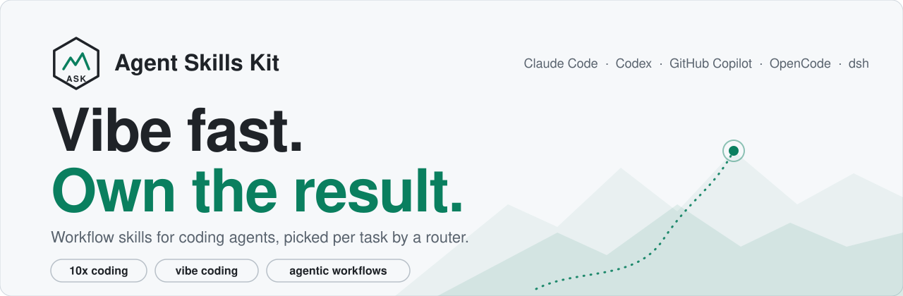
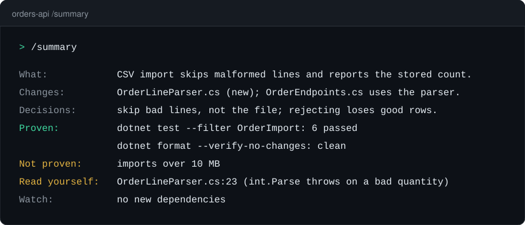
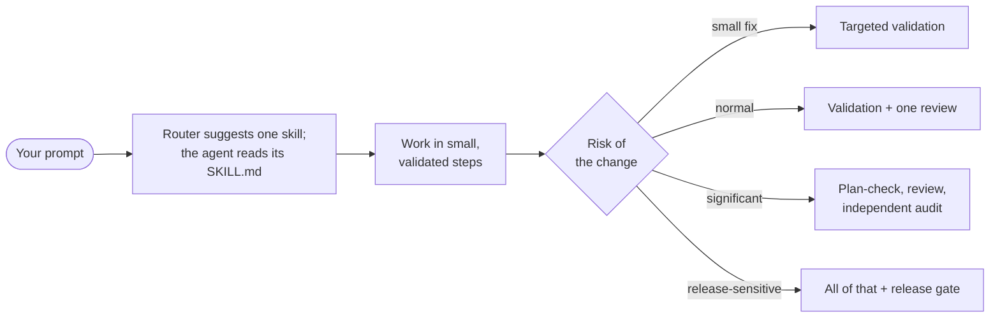

<!-- hero:start -->
<p align="center">
  <picture>
    <source media="(prefers-color-scheme: dark)" srcset="assets/hero-dark.svg" />
    
  </picture>
</p>

<p align="center">
  <strong>ASK (Agent Skills Kit) makes your coding agent work like a careful senior engineer, without the ceremony.</strong><br />
  Every task lands on the right workflow skill, and review and proof grow with the risk of the change. A git guard stops the commands you'd regret. You get code you can read, and a summary that says what ran and what didn't.
</p>

<p align="center">
  <a href="https://github.com/MarkBovee/agent-skills-kit/actions/workflows/ci.yml"></a>
  <a href="https://github.com/MarkBovee/agent-skills-kit/releases/latest"></a>
  <a href="./LICENSE"></a>
</p>

<p align="center">
  <code>18 skills</code>
  <code>1 router</code>
  <code>5 hosts</code>
  <code>review + proof gates</code>
</p>

<p align="center">
  <a href="#quick-start">Quick start</a> •
  <a href="#see-it-work">See it work</a> •
  <a href="#built-for-how-you-work">Who it is for</a> •
  <a href="#how-it-works">How it works</a> •
  <a href="#skills">Skills</a> •
  <a href="#works-with">Hosts</a> •
  <a href="#faq">FAQ</a> •
  <a href="./CHANGELOG.md">Changelog</a>
</p>
<!-- hero:end -->

---

## Quick start

**Claude Code** (two commands, nothing else to install):

```text
/plugin marketplace add MarkBovee/agent-skills-kit
/plugin install agent-skills-kit@agent-skills-kit
```

Start a new session. The first prompt gets a routing hint and the workflow risk with its gates. The short slash commands such as `/summary` also need the bootstrap install below; with the plugin alone, use `/agent-skills-kit:ask-summary`.

<details>
<summary><strong>Codex, GitHub Copilot, OpenCode, dsh</strong>, and the shared skills root</summary>

<br />

```bash
# Linux / macOS
curl -fsSL https://raw.githubusercontent.com/MarkBovee/agent-skills-kit/main/scripts/bootstrap.sh | bash
```

```powershell
# Windows
irm https://raw.githubusercontent.com/MarkBovee/agent-skills-kit/main/scripts/bootstrap.ps1 | iex
```

The bootstrap script installs the latest stable tag and never replaces your own skills, so rerunning it is safe. Would you rather read it first? Download `scripts/bootstrap.sh` (or `bootstrap.ps1`), read it, and run it locally. [docs/hosts.md](./docs/hosts.md) has the install paths, the environment variables, the update commands, and troubleshooting.

</details>

## Why

Agents ship code that passes its own tests and that you can't explain a week later. The usual symptoms:

* The same logic gets rewritten inline instead of reusing a helper that already exists.
* One file grows until nobody wants to open it.
* Comments vanish, or narrate the obvious and never say *why*.
* Layers, factories, and wrappers appear for needs nobody has.
* "Done" means "I ran something".

You can ship that fast. You can't own it. ASK fixes it at the source, in the agent's own workflow.

## See it work

Illustrative examples of what the standards ask for. The rules are language-agnostic; the full code (C#) is in [docs/examples.md](./docs/examples.md).

| Concern | Typical agent output | With ASK |
| --- | --- | --- |
| **Helpers** | A 15-line route handler that parses, normalizes, and saves inline | The handler orchestrates; a named `OrderLineParser.Parse` does the parsing, and existing helpers get reused first |
| **Files** | `Orders.cs` with five types and 600 lines | One public type per file, named for the type |
| **Comments** | None, or `// add 1 to retries` | An intent comment above every function, and a *why* where it matters: `// The carrier API allows 5 requests per second, so retry with backoff` |
| **KISS** | An interface, a factory, a decorator, and an options class for one cached lookup | One method with a one-hour cache; review flags the single-implementation factory as possible speculative generality |
| **Proof** | "Done, tests pass." | A summary that splits what was run from what was not |

After a change, `/summary` hands you this, derived from the diff and not from the conversation:

<p align="center">
  
</p>
<p align="center"><sub>Illustrative output, not a captured run.</sub></p>

With that in hand you can explain the change without having watched it get written.

## Built for how you work

| Use | What ASK does for you |
| --- | --- |
| **Vibe coding**<br />Ship fast without losing the thread. | `/summary` says what changed and what ran, and points at the line to read first.<br />A small fix goes `EXECUTE → VALIDATE`: no review ceremony, no audit.<br />The git guard blocks `reset --hard`, force pushes, pushes to `main`, and a few other destructive commands. |
| **10x coding**<br />Hold the agent to a senior bar. | The standards ask for small functions and reuse before adding. Every function gets an intent comment, and review treats a missing one as blocking.<br />Review also flags speculative abstraction and pass-through layers.<br />Normal work gets one combined review; significant work adds an independent audit. |
| **Agentic workflows**<br />Run agents where the outcome has to be right. | Reviewer, auditor, and researcher subagents that report but never edit send `ASK_WORKFLOW_*` markers, and the review reminder stays until that evidence arrives.<br />`agent-workflows` coordinates parallel agents and `handoff` briefs the next one.<br />Every skill ships behavior evals, at least three scenarios each. |

## How it works


```mermaid
flowchart LR
    P([Your prompt]) --> R["Router suggests one skill;<br/>the agent reads its SKILL.md"]
    R --> W["Work in small,<br/>validated steps"]
    W --> K{"Risk of<br/>the change"}
    K -->|small fix| A["Targeted validation"]
    K -->|normal| B["Validation + one review"]
    K -->|significant| C["Plan-check, review,<br/>independent audit"]
    K -->|release-sensitive| D["All of that + release gate"]
```

* A suggestion stays a hint until the agent actually reads the skill file. `develop` is the default when nothing more specific matches.
* After code edits, a review reminder stays until review evidence arrives.
* **Models (Claude Code):** you pick the model for the conversation (Haiku works fine as the front agent). Workflow skills such as `develop`, `debugging`, `research`, and `verification` run in a Sonnet worker, `ask-worker`. Intake stays on your model because it asks you questions; `deep-research` stays there too, because it starts its own subagents.

| Tier | Claude model | Used for |
| --- | --- | --- |
| `light` | Haiku | Mechanical lookups, grep, summaries of command output |
| `standard` | Sonnet | Workflow skills, implementation, validation, review |
| `deep` | Opus (only with a stated reason) | Architecture tradeoffs, hard root-cause analysis |

A typical session:

```text
You:  "test/page.test.js started failing after my change."
ASK:  suggests debugging → the agent reads ask-debugging → reproduces, finds the root cause,
      fixes it, and re-runs the test before saying it works.

You:  "Review it before I push."
ASK:  suggests code-review → findings ranked by severity, with file and line.
```

The decision tree, risk lifecycle, and cost-aware execution profile are in [docs/workflow.md](./docs/workflow.md).

## Skills

| Stage | Skills | What they do |
| --- | --- | --- |
| Research | `research`, `deep-research` | Answer a bounded question with sources, or run a multi-source investigation with contradictions and a cited handoff. |
| Start | `intake` | Clarify fuzzy work with grill rounds, then plan it with scope, constraints, and a definition of done. |
| Execute | `develop`, `debugging` | Make normal changes in small validated steps; find root causes. |
| Validate | `code-review`, `verification` | Review a diff against standards and requirements; prove a claim before saying it works. |
| Hand over | `summary`, `handoff` | Explain what changed and what is proven so you own the result; brief the next agent. |
| Improve | `improve`, `session-review` | Audit and refactor; reflect on a session and file follow-ups. |
| Coordinate | `agent-workflows`, `write-skill` | Coordinate subagents and release chores; write and revise skills. |
| Product | `design`, `design-review` | Build interfaces beyond bland defaults; filter them for AI-default patterns. |
| Write | `text-writing` | Write text that sounds human. |
| Operate | `gh-inbox`, `observability` | Triage a repository's GitHub issues; add logging, metrics, tracing, and alerting. |

Start with `develop`, `code-review`, and `summary`. Building agent pipelines? Add `agent-workflows` and `handoff`.

Every skill has a slash command: `/develop`, `/debugging`, `/gh-inbox`, and so on. The short form needs the shared skills from the bootstrap install. The skill id works everywhere in Claude Code: `/ask-develop`, or `/agent-skills-kit:ask-develop` when ASK is installed as a plugin.

## Works with

Claude Code first: new workflow behavior is designed and validated there. OpenCode and dsh reuse the routing logic in `core/router-core.js`, and every host reads skills exported from the same source.

| Host | How ASK plugs in |
| --- | --- |
| Claude Code | Plugin and marketplace: hooks, subagents, native skills, rules |
| OpenCode | Router plugin with a TUI sidebar, managed skills, slash commands |
| Codex | Native discovery of `~/.agents/skills/`; no config changes |
| GitHub Copilot / VS Code | Agent plugin, generated skills, instructions, prompt files |
| DeepSeek Harness (dsh) | Generated skills, routing guidance, optional router preset |

## Safety and transparency

ASK installs files and runs hooks inside your agent sessions, so here's what it does and doesn't do.

* **Hints on Claude Code, a gate on OpenCode.** The Claude Code router suggests one skill per task and never rewrites your commands or takes over a session. The OpenCode router also blocks edits and shell calls until the agent has read a skill file, and dsh does the same when you turn on `blockUntilSkillLoaded`.
* **A git guard, on by default.** In Claude Code it blocks `reset --hard`, `clean -f`, `branch -D`, `checkout .`, `restore .`, force, delete, and mirror pushes, and any push to `main` or `master`. Set `ASK_GIT_GUARD=strict` to block every push or `off` to disable it. It is a safety net against agent mistakes, not a security boundary; details in [docs/hosts.md](./docs/hosts.md#git-guard).
* **No network calls from the hooks.** The Claude Code hooks run `scripts/agent-skills-hook.js` and the modules in `core/`, with no dependencies. They read local files, ask local git for the current branch, and keep session state on disk.
* **Installers stay in their lane.** They never replace your own skills, and the Claude wiring comes out again with `scripts/install.sh --uninstall-claude` (`-UninstallClaude` on Windows).
* **Found a vulnerability?** Report it privately; see [SECURITY.md](./SECURITY.md).

## FAQ

<details>
<summary><strong>Will it slow my agent down?</strong></summary>

<br />

No. A small fix goes `EXECUTE → VALIDATE`: targeted validation, no separate review, no audit. New tests follow a budget instead of a reflex, and the heavier gates only show up when the risk calls for them.

</details>

<details>
<summary><strong>Can I use it for unattended or multi-agent runs?</strong></summary>

<br />

That's what the gates and evidence markers are for. Subagents report `ASK_WORKFLOW_PASS`, `_FINDINGS`, `_BLOCKED`, or `_FAILED` with a phase, and missing output is never a pass. ASK doesn't run your agents for you. It supplies the rules and the checks, and it defines the reviewer and auditor roles.

</details>

<details>
<summary><strong>Which model do I need?</strong></summary>

<br />

Any model works as the front agent, Haiku included. On Claude Code the workflow skills run in a Sonnet worker, and Opus is used only with a stated reason. The tier table above has the details.

</details>

<details>
<summary><strong>Does it replace my CLAUDE.md or AGENTS.md?</strong></summary>

<br />

No. Your own instructions stay where they are, and ASK adds its workflow rules and routing hints next to them.

</details>

<details>
<summary><strong>How is it different from superpowers, agent-skills, or spec-kit?</strong></summary>

<br />

They're good projects, and nothing stops you from running one next to ASK: [obra/superpowers](https://github.com/obra/superpowers), [addyosmani/agent-skills](https://github.com/addyosmani/agent-skills), and [github/spec-kit](https://github.com/github/spec-kit). ASK's own focus is a router that suggests one skill per prompt, gates sized to the risk of the change, evidence the agent has to produce, and a git guard. Pick the mix that fits how you work.

</details>

<details>
<summary><strong>How do I update or uninstall?</strong></summary>

<br />

Bootstrap installs update when you rerun `bootstrap.sh` or `bootstrap.ps1`, and a local clone updates with `scripts/update.sh` (`update.ps1` on Windows). To remove the Claude wiring, run `scripts/install.sh --uninstall-claude` (`scripts/install.ps1 -UninstallClaude` on Windows). The commands are in [docs/hosts.md](./docs/hosts.md#updating) and [docs/hosts.md](./docs/hosts.md#installer-modes).

</details>

## Documentation

| Read | For |
| --- | --- |
| [docs/examples.md](./docs/examples.md) | Before and after examples: helpers, files, comments, KISS, proof, grill rounds |
| [docs/hosts.md](./docs/hosts.md) | Install paths, installer modes, per-host details, troubleshooting, updates |
| [docs/workflow.md](./docs/workflow.md) | Routing, decision tree, risk-based lifecycle, cost-aware execution |
| [docs/maintenance.md](./docs/maintenance.md) | Regenerating exports, validation commands, release flow |
| [ARCHITECTURE.md](./ARCHITECTURE.md) | How the pieces fit, generated versus hand-edited files |
| [AGENTS.md](./AGENTS.md) | Binding contributor rules |
| [CHANGELOG.md](./CHANGELOG.md) | Project history |

## Contributing

Edit `skills/*/SKILL.md`, then run `node ./scripts/export-platform-skills.js`; generated exports are never hand-edited. Run the checks listed in [AGENTS.md](./AGENTS.md#required-checks) before opening a PR. More in [CONTRIBUTING.md](./CONTRIBUTING.md).

## License

MIT, see [LICENSE](./LICENSE). Copyright (c) 2026 Mark Bovee.
